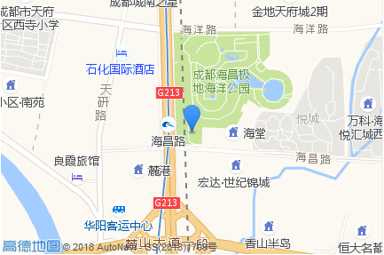
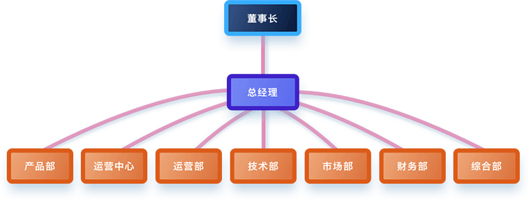

## 顺点科技

#### 公司介绍 :

​	成都顺点科技有限公司创立于2014年11月，总部位于成都。公司旗下设立“源本”品牌， 致力于通过打造互联网产品提升农副产品流通效率与食品安全防控能力。目前“源本”品牌 下涵盖三款产品，分别是帮助农副产品流通贸易商进行内部协同办公的SaaS服务平台—理菜宝； 帮助农副产品生产环节各类主体扩大销售渠道的大宗农副产品B2B撮合交易平台—找生鲜； 帮助食品安全监管部门提升监管效率、扩大监管边界、提高智慧化监管水平的智慧食安体系。 

​        成都顺点科技有限公司探索并建立了一个基于交易的食品安全追溯系统，提供了一套针对食品生产、流通和消费各环节主体，以及政府食品安全监管部门的食品追溯信息化管理工具。 

​        公司开发“源本生鲜”溯源电商平台，实现学校、医院、机关食堂和社会餐饮等组织或机构在网络平台自助选择食材供应商进行交易，并完成食品追溯的信息化管理的目标。

​	开发“找生鲜网”，将食品流通环节向上游延伸，为农业生产者拓展销路的同时，完成“从农田到餐桌”的食品全流程追溯。 	

​	以交易为基础，通过食品检验检测、食品安全认证管理、生产经营主体诚信管理、食品安全信息公开等方式，建立健全了多维度的食品安全防控体系，并形成对各方食品安全责任的倒逼。

​	通过收集、分析、应用以溯源为基础形成的海量数据，有效提升了政府食品安全监管工作效率，促进了现代农业和现代物流的发展，实现行政资源利用的最优化，经济效益和社会效益的最大化。

公司地址 : 成都双流县都市天府大道南段天府菁蓉大厦11楼 

#### 公司发展历程 :

​	自2014年创立以来，公司先后在北京、青岛等全国19个城市落地， 各类型用户总数超过6万家。公司的发展也受到国内外资本的青睐。 在2015年，公司已获得上千万融资。  在市场取得优秀成绩的同时，公司致力于改善行业社会食品安全现状， 提升城市食品安全防控能力的努力也被各级政府认同。2016年10月，全国 “两个创建”现场会在成都召开，公司作为重点点位，受到包括汪洋副总理、 农业部领导以及食药监总局领导的考察与肯定。 

#### 公司团队架构 : 

​	徐晓晨 CEO

​	根据企业战略方向以及核心业务流程，为实现组织高效协同工作，提升组织整体效能， 公司采用扁平化管理方式。在董事长和总经理的管理之下，企业组织架构设置如下部门： 产品部，全国运营中心，运营部，技术部，市场部，财务部，综合部。每部门各司其职， 岗位设置合理，实行专业化，规范化，职业化的管理模式。 

公司大概100多人.

#### 产品介绍 :

[源本](http://www.ybveg.com/bigIndex.html)

源本是一个致力于提升农副产品流通效率与食品安全防控能力的综合平台

- 源本理菜宝: 

		为农副产品贸易商（食材供应商、批发商等）提供的内部协同类ERP系统

- 智慧食安

  为食药监管体系打造集省、市、区县、街道四级联动的“三品一械”、“特种设备”一体化监管服务智能大数据平台

- 源本找生鲜

  为农副产品生产者（基地、合作社、食品企业）搭建的大宗商品网络销售平台

#### 我的职责 :

主要利用  django 及 flask  做web 应用的开发 , 利用爬虫对网络上一些相关数据的采集,   以及简单的数据分析,  并对所开发的项目进行日常的维护.